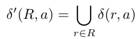

## Question 1

Two stacks are created - operator and automata. We loop through the expression, if the character belongs to `letters` we push `q1 -c-> q2` into automata, otherwise we push it to operator stack. The operator stack is evaluated in this way 
* If `*`, we pop one element from automata stack, apply the `*` operation on it and push it to automata again.
* If union or concatenation operator, we pop two elements and apply the operation and push it back to automata.   

This method has been inspired by [this](https://github.com/sdht0/automata-from-regex).

## Question 2
* DFA's states is equal to power set of NFA's states.
* DFA's letters, start states are same as NFA(assuming NFA has only one state).
* The transition function is obtained by following relation, for every state R in DFA, 

This method has been inspired by the textbook.

